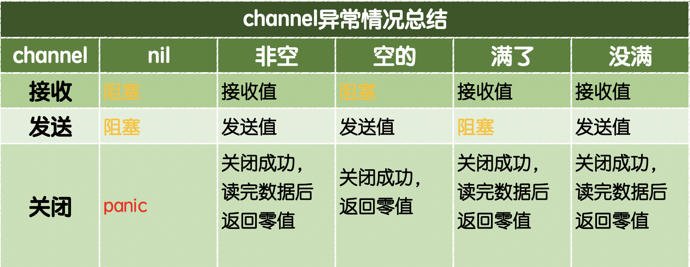
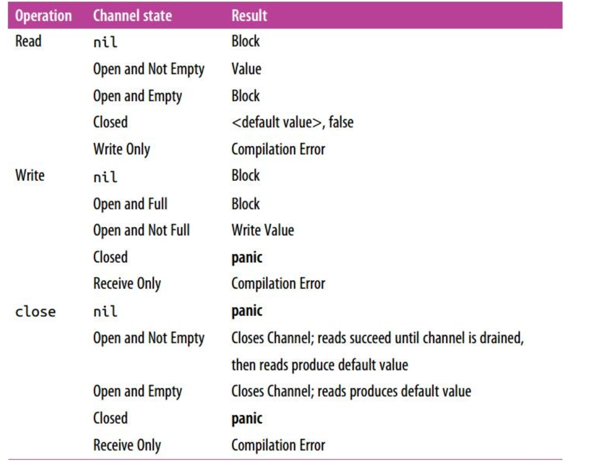

# go 标准库

# go类型

#### channel

通道的基本发送和接收都阻塞

#### 第三方库收集

[excel表格](https://github.com/360EntSecGroup-Skylar/excelize)
[excelb表格](https://github.com/tealeg/xlsx)
[goredis](github.com/go-redis/redis)
[.env配置文件](https://github.com/joho/godotenv)
[日志搜索系统Poseidon](https://github.com/Qihoo360/poseidon)

#### 优秀书籍

[Mastering_Go_ZH_CN](https://github.com/hantmac/Mastering_Go_ZH_CN/releases/tag/v1.0)